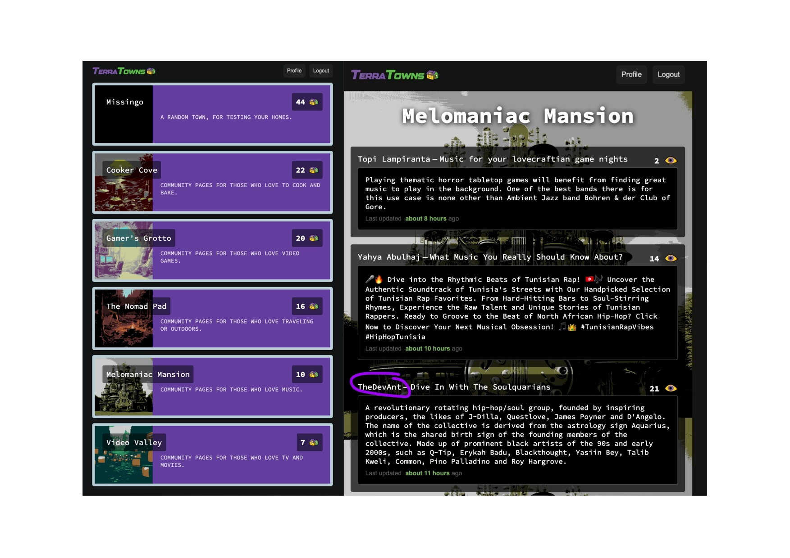
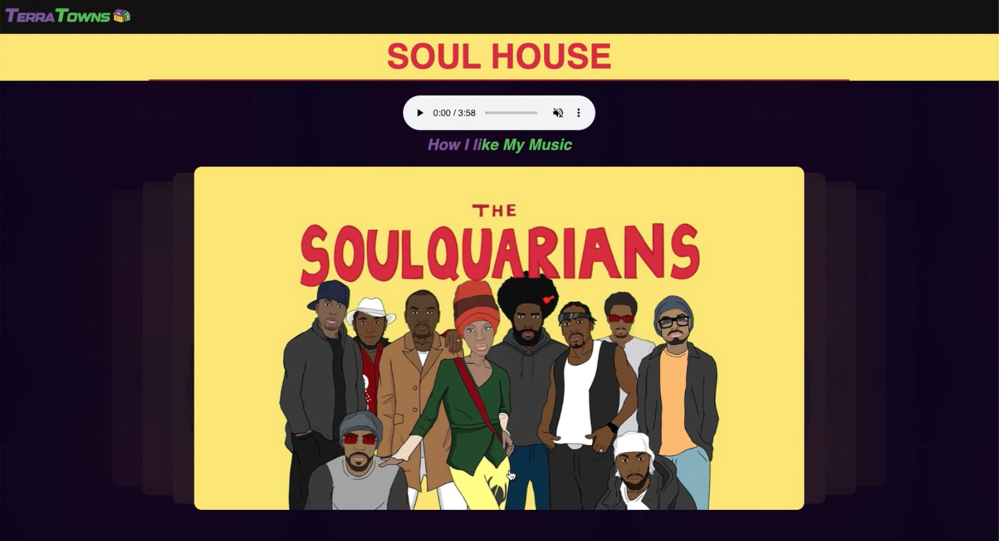

  <h1>Terraform Beginner Bootcamp 2023</h1>
  <h3>Welcome to my humble <a href="https://terratowns.cloud/h/bf6e6418-bdd0-42f8-a985-153b5dfd5901"><em>TerraHouse</em>𝛼</a></h2>

  

###

- [Bootcamp Learning Portal](https://app.exampro.co/student/journey/terraform-cpb)
- [Project Template](https://github.com/ExamProCo/terraform-beginner-bootcamp-2023) from ExamProCo.
- Obtained the [Terraform Associate 003](https://www.hashicorp.com/certification/terraform-associate) on 1st Sep 2023, now on to the Terraform Beginner Bootcamp to apply knowledge.
- Bootcamp Complete: [View Certificate](https://www.linkedin.com/in/anthonyadesanwo/overlay/1635545622609/single-media-viewer/?profileId=ACoAADdjtGMBnQNNMWIpESWjnpa7tvx3vjJTl9k)

## Journaling Homework

The `/journal` directory contains:

- [x] [Introduction](#terraform-beginner-bootcamp-2023)
- [x] [Week 0 - Project Preparation](journal/week0.md)
- [x] [Week 1 - Building **Terrahouse**](journal/week1.md)
- [x] [Week 2 - Connecting to **TerraTowns**](journal/week2.md)
- [x] <strong>Extra</strong>3 - Decorating Terrahouse in [**Melomaniac Mansion**](https://terratowns.cloud/t/melomaniac-mansion)

## [Terratowns Platform](https://terratowns.cloud)

## [Terrahouse Preview](https://terratowns.cloud/h/bf6e6418-bdd0-42f8-a985-153b5dfd5901)

## Offical House Viewing

