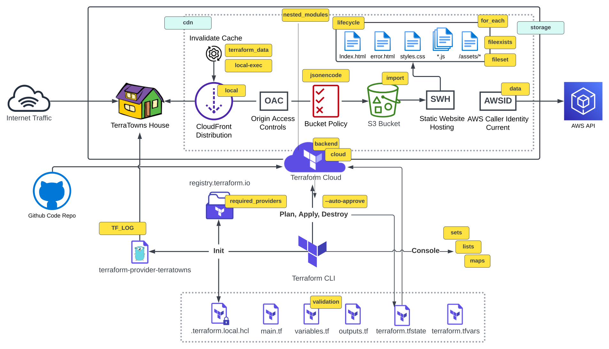

# Week 2 - Connecting to TerraTowns
<ins>Table of Contents</ins>
- [Introduction to Ruby](#introduction-to-ruby)
    - [Bundler](#bundler)
    - [Install Gems](#install-gems)
    - [Executing Ruby scripts w/ bundler](#executing-ruby-scripts-w-bundler)
    - [Sinatra](#sinatra)
- [Terratowns Mock Web Server](#terratowns-mock-server)
    - [Running the Web Server](#running-the-web-server)
- [Introduction to Golang](#introduction-to-golang)
    - [Custom Terraform Provider](#custom-terraform-provider)
    - [Implementing CRUD](#implementing-crud)
- [Terratown and Terrahouse Diagram](#terratown-and-terrahouse-diagram)

## Introduction to Ruby
Ruby is an interpreted, high-level, general purpose programming language. In Ruby, everything is an object, including primitive data types.

### Bundler
Bundler is package manager for Ruby and it is the primary way to install Ruby packagaes, known as gems, for Ruby.

### Install Gems
You need to create a Gemfile and define your gems in that file.

```rb
source "https://rubygems.org"

gem 'sinatra'
gem 'rake'
gem 'pry'
gem 'puma'
gem 'activerecord'
```

Then you need to run the  `bundle install` command

This will install the gems on the system globally (unlike node.js which installs packages in place in a folder caled node_modules)

A Gemfile.lock will be create to lock in the Gem versios used in this project.

### Executing Ruby scripts w/ bundler
We use `bundle exec` to tell future ruby scriots to use the hems we installed. This is the way we set context.

### Sinatra
Sinatra us a micro-web framework for ruby to build web apps. Great for mock or dec server or for very simple projects. Allowing you to create a web server in a single file.

[Sinatra Ruby](https://sinatrarb.com/)

## Terratowns Mock Web Server
Using Ruby a mock web server was made to test the provider is built correctly, CRUD requests are successful and Terrahouse details are passed correctly.

### Running the Web Server
We can run the web server by executing the follwoing commands:

```rb
bundle install
bundle exec ruby server.rb
```

All of the code for our server is stored in the `server.rb` file.

## Introduction to Golang
`Go` is a statically typed, compiled high-level programming level designed at Google.

### Custom Terraform Provider
Our custom Terraform Provider was written in Go, and offered some exposure to a new language. 


### Implementing CRUD
Terraform Provider resources utilise CRUD.

CRUD stands for Create, Read, Update and Delete.

## Terratown and Terrahouse Diagram



<hr width="75%">
<h1 display="flex" align="center">🙌🏾 🙌🏾 🙌🏾</h1>